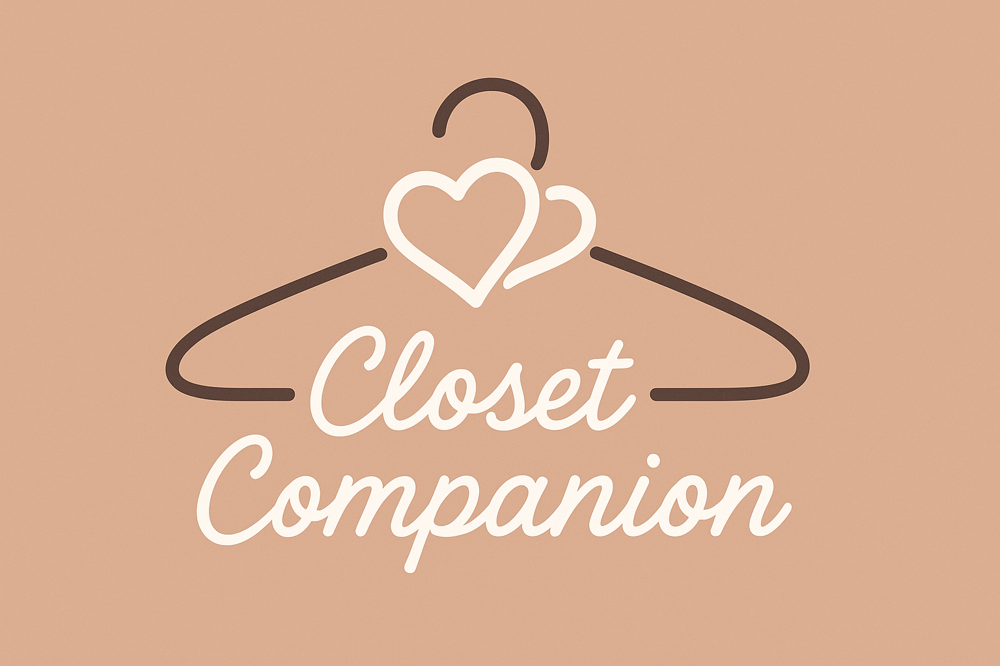

# Closet Companion

Closet Companion is an innovative AI-powered fashion assistant that helps users decide what to wear through personalized outfit recommendations. Using a sophisticated multi-agent architecture with 7 specialized LLMs, it considers weather conditions, occasions, and personal style preferences to deliver expertly tailored fashion advice.

## 🔗 Try It Live!

**[👔 Use Closet Companion Now](https://www.stack-ai.com/chat/681fd469b8e6cb735bbffa6d-2DnXFu5ZCpHqWEemESHNh4)**

Experience the power of AI-driven fashion advice firsthand! Our live demo gives you instant access to personalized outfit recommendations based on weather, occasion, and style preferences.

## 🌟 Features

- **Weather-Aware Recommendations**: Integrates with AccuWeather to suggest outfits appropriate for current conditions
- **Occasion-Specific Styling**: Tailors recommendations to different events (job interviews, casual outings, formal events)
- **Personal Style Integration**: Incorporates user color preferences, favorite items, and style notes
- **Natural Language Interface**: Simple chat interface for intuitive interaction
- **Advanced Multi-Agent System**: 7 specialized LLMs working in concert for comprehensive fashion intelligence

## 🤖 Multi-Agent Architecture

What makes Closet Companion unique is its advanced agentic approach, using 7 specialized AI models that collaborate to provide comprehensive fashion advice:

### Agent System

| Agent | Role | Responsibility |
|-------|------|----------------|
| **Query Interpreter** | Initial understanding | Analyzes user requests to determine intent and extract key information |
| **Fashion Stylist** | Style expertise | Creates weather-appropriate outfit combinations with aesthetic harmony |
| **Occasion Specialist** | Social context | Refines recommendations based on event type and dress code requirements |
| **Personal Style Advisor** | Personalization | Adapts suggestions to align with user's documented preferences |
| **Fashion Concierge** | General assistance | Handles fashion questions outside the core recommendation workflow |
| **Outfit Finalizer** | Synthesis | Combines insights from all specialists into cohesive recommendations |
| **Style Educator** | Fashion knowledge | Provides background information on style principles and fashion advice |

This collaborative system mimics an entire fashion department working together to create the perfect outfit recommendation, with each agent contributing specialized knowledge and expertise.

## 🔧 Technical Implementation

- **Platform**: Built using [StackAI](https://stack-ai.com/) for advanced workflow orchestration
- **AI Models**: Powered by 7 interconnected OpenAI GPT-4o Mini models
- **Weather Data**: Integration with AccuWeather API
- **Data Structure**: Structured wardrobe catalog and user preference system
- **Interface**: Clean, conversational chat UI
- **Complex Workflow**: Multi-stage processing with parallel and sequential agent operations

## 📸 Screenshots

